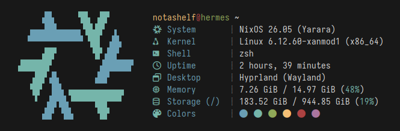

<!-- markdownlint-disable MD013 MD033 MD041 -->

<div align="center">
    
    
</div>

<div id="doc-begin" align="center">
  <h1 id="header">Microfetch</h1>
  <p>Microscopic fetch tool in Rust, for NixOS systems, with special emphasis on speed</p>
  <br/>
  <a href="#synopsis">Synopsis</a><br/>
  <a href="#features">Features</a> | <a href="#motivation">Motivation</a> | <a href="#benchmarks">Benchmarks</a><br/>
  <a href="#installation">Installation</a>
  <br/>
</div>

## Synopsis

[fastfetch]: https://github.com/fastfetch-cli/fastfetch

Stupidly small and simple, laughably fast, and pretty fetch tool. Written
(mostly) in Rust for speed and ease of maintainability. Runs in a _fraction of a
millisecond_ and displays _most_ of the nonsense you'd see posted on r/unixporn
or other internet communities. Aims to replace [fastfetch] on my personal
system, but [probably not yours](#customizing). Though, you are more than
welcome to use it on your system: it is pretty _[fast](#benchmarks)_...

<p align="center">
  <br/>
  
  <br/>
</p>

## Features

- Fast
- Really fast
- No dependencies (not even libc!)
- Tiny binary (~24kb)
- Actually _really_ fast
- Cool NixOS logo, with support for custom logo text
- Reliable detection of following info:
  - Hostname/Username
  - Kernel
    - Name
    - Version
    - Architecture
  - Current shell (from `$SHELL`, trimmed if store path)
  - Current Desktop (DE/WM/Compositor and display backend)
  - Memory Usage/Total Memory
  - Storage Usage/Total Storage (for `/` only)
  - Shell Colors
- Did I mention fast?
- Respects [`NO_COLOR` spec](https://no-color.org/)
- Funny [^1]

[^1]: I don't know how else to describe the (unhealthy) amount of handwritten
    assembly that was written in order to make Microfetch faster.

## Motivation

[Rube-Goldmark Machine]: https://en.wikipedia.org/wiki/Rube_Goldberg_machine

Fastfetch, as its name _probably_ already hinted, is a very fast fetch tool
written in C. I _used to_ use Fastfetch on my systems, but I eventually came to
the realization that I am _not interested in any of its additional features_. I
don't use Sixel, I don't change my configuration more than maybe once a year and
I don't even display most of the fields that it has. Sure, the configurability
is nice and _I could_ configure the defaults that I do not like... but how often
do I really do that?

Since I already enjoy programming challenges, and don't use a fetch program that
often, I eventually came to try and answer the question _how fast can I make my
fetch script?_ It is an _even faster_ fetch tool that I would've written in Bash
and put in my `~/.bashrc` but is _actually_ incredibly fast because it opts out
of all the customization options provided by tools such as Fastfetch. Since
Fetch scripts are kind of a coming-of-age ritual for most Linux users, I've
decided to use it on my system. You also might be interested if you like the
defaults and like speed. Ultimately, Microfetch a small, opinionated binary with
a nice size that doesn't bother me, and _incredible_ speed. Customization? No
thank you.

I cannot re-iterate it enough, Microfetch is _annoyingly fast_. It, however,
does not solve a real technical problem. The "problem" Microfetch "solves" is
entirely self-imposed. I want a fast, _almost_ zero-cost command invocation and
for it to not take that much space on my system. Thanks to the nature of Rust,
Microfetch is _fast_. Rust does, or well, _did_ mean "bloated" dependency trees
and slightly increased build times, though, as of 0.5.0 Microfetch has
(voluntarily) dropped both `std` and `libc`. You can go check the numbers for
the speed impact (hint: it's much better) but we also have little to no concerns
left about build times and the binary size. Build times are also _very easily_
mitigated with Nix's binary cache systems, and since Microfetch is already in
Nixpkgs you are strongly encouraged to use `pkgs.microfetch` over the flake. The
usage of Rust _is_ quite nice, however, since it provides us with incredible
tooling and a very powerful language that allows for Microfetch to be as fast as
possible.

Surely C would've been a smaller choice, but I like Rust more. Microfetch _also_
features a whole bunch of handwritten assembly with per-platform support to
_unsafely_ optimize most syscalls. In hindsight you all should have seen this
coming. Is it faster? Yes. Is it better? Uh, yes. Should you use this? Yes.

Also see: [Rube-Goldmark Machine]

## Benchmarks

Below are the benchmarks that I've used to back up my claims of Microfetch's
speed. It is fast, it is _very_ fast and that is the point of its existence. It
_could_ be faster, and it will be. Eventually.

At this point in time, the performance may be sometimes influenced by
hardware-specific race conditions or even your kernel configuration. Which means
that Microfetch's speed may (at times) depend on your hardware setup. However,
even with the worst possible hardware I could find in my house, I've achieved a
nice less-than-1ms invocation time. Which is pretty good. While Microfetch
_could_ be made faster, we're in the territory of environmental bottlenecks
given how little Microfetch actually allocates.

Below are the actual benchmarks with Hyperfine measured on my Desktop system.
The benchmarks were performed under medium system load, and may not be the same
on your system. Please _also_ note that those benchmarks will not be always kept
up to date, but I will try to update the numbers as I make Microfetch faster.

| Command      |         Mean [µs] | Min [µs] | Max [µs] |       Relative | Written by raf? |
| :----------- | ----------------: | -------: | -------: | -------------: | --------------: |
| `microfetch` |      604.4 ± 64.2 |    516.0 |   1184.6 |           1.00 |             Yes |
| `fastfetch`  | 140836.6 ± 1258.6 | 139204.7 | 143299.4 | 233.00 ± 24.82 |              No |
| `pfetch`     | 177036.6 ± 1614.3 | 174199.3 | 180830.2 | 292.89 ± 31.20 |              No |
| `neofetch`   | 406309.9 ± 1810.0 | 402757.3 | 409526.3 | 672.20 ± 71.40 |              No |
| `nitch`      | 127743.7 ± 1391.7 | 123933.5 | 130451.2 | 211.34 ± 22.55 |              No |
| `macchina`   |   13603.7 ± 339.7 |  12642.9 |  14701.4 |   22.51 ± 2.45 |              No |

The point stands that Microfetch is significantly faster than every other fetch
tool I have tried. This is to be expected, of course, since Microfetch is
designed _explicitly_ for speed and makes some tradeoffs to achieve its
signature speed.

> [!IMPORTANT]
> Some tools are excluded. Yes, I know. If you think they are important and thus
> should be covered in the benchmarks, feel free to create an issue. The purpose
> of this benchmarks section is not to badmouth other projects, but to
> demonstrate how much faster Microfetch is in comparison. Obviously Microfetch
> is designed to be small (in the sense of scope) and fast (in every definition
> of the word) so I speak of Microfetch's speed as a fact rather than an
> advantage. Reddit has a surprising ability to twist words and misunderstand
> ideals.

### Benchmarking Individual Functions

[Criterion.rs]: https://github.com/bheisler/criterion.rs
[Getting Started Guide]: https://bheisler.github.io/criterion.rs/book/getting_started.html

To benchmark individual functions, [Criterion.rs] is used. See Criterion's
[Getting Started Guide] for details or just run `cargo bench` to benchmark all
features of Microfetch.

### Profiling Allocations and Timing

[Hotpath]: https://github.com/pawurb/hotpath

Microfetch uses [Hotpath] for profiling function execution timing and heap
allocations. This helps identify performance bottlenecks and track optimization
progress. It is so effective that thanks to Hotpath, Microfetch has seen a 60%
reduction in the number of allocations.

To profile timing:

```bash
HOTPATH_JSON=true cargo run --features=hotpath
```

To profile allocations:

```bash
HOTPATH_JSON=true cargo run --features=hotpath,hotpath-alloc
```

The JSON output can be analyzed with the `hotpath` CLI tool for detailed
performance metrics. On pull requests, GitHub Actions automatically profiles
both timing and allocations, posting comparison comments to help catch
performance regressions.

## Installation

> [!NOTE]
> You will need a Nerd Fonts patched font installed, and for your terminal
> emulator to support said font. Microfetch uses Nerd Fonts glyphs by default,
> but this can be changed by [patching the program](#customizing).

Microfetch is packaged in [nixpkgs](https://github.com/nixos/nixpkgs). It can be
installed by adding `pkgs.microfetch` to your `environment.systemPackages`.
Additionally, you can try out Microfetch in a Nix shell or install it using
flakes on non-NixOS systems.

```bash
# Enter a Nix shell with Microfetch; this will be lost on the next GC
nix shell nixpkgs#microfetch

# Install Microfetch globally; this will be kept on GC
nix profile add nixpkgs#microfetch
```

Or run it directly with `nix run`

```bash
# Run Microfetch from Nixpkgs. Subsequent runs will be faster.
nix run nixpkgs#microfetch
```

[crates.io]: https://crates.io/crates/microfetch

Non-Nix users, if they plan to run this for some reason, will need to build
Microfetch from source or install it with `cargo`. Microfetch is published on
[crates.io] and can be installed with `cargo install`.

```bash
# Get Microfetch from crates.io
cargo install microfetch
```

### Other Distros

<!-- Remove & replace with "unofficial" warning if adding distro-specific instructions -->

To my knowledge, there is no package for (nor a reason to package) Microfetch
but if you run a patched version for your distribution, feel free to leave your
repository (AUR, COPR, etc.) here as reference for those that might be
interested in Microfetch tailored to their distributions.

## Customizing

You can't*

### Really?

[main module]: ../microfetch/src/main.rs
[discussions tab]: https://github.com/NotAShelf/microfetch/discussions

To be fair, you _can_ customize Microfetch by, well, patching it. It is
certainly not the easiest way of doing so but if you are planning to change
something in Microfetch, patching is the best way to go. It will also be the
only way that does not compromise on speed, unless you patch in bad code.
Various users have adapted Microfetch to their distribution of choice by
patching the [main module] and inserting the logo of their choice. This is also
the best way to go if you plan to make small changes. If your changes are not
small, you might want to look for a program that is designed to be customizable;
Microfetch is built for maximum performance and little else.

The Nix package allows passing patches in a streamlined manner by passing
`.overrideAttrs` to the derivation. You can apply your patches in `patches` and
share your derivations with people. Feel free to use the [discussions tab] to
share your own variants of Microfetch!

The real reason behind lack of customizability is that customization, of most
kinds, is "expensive": reading environment variables, parsing command-line
arguments or reading a configuration file inflates execution time and resource
consumption. Since Microfetch is closer to a code golf challenge than a program
that attempts to fill a gap, runtime configuration is not supported. Patching
the source is the only way to make changes that do not compromise on speed. The
exception to this, as described below, is the custom logo support.

### Logo

Microfetch used to be impossible to customize without patching. Fortunately it's
possible now to customize the logo to support your distribution. This is
best-effort, but should work for most cases as long as you adhere to the
constraints.

To use a custom logo, set the `MICROFETCH_LOGO` environment variable to 9
newline-separated lines of ASCII or Unicode art when building:

```bash
# Pass your logo text with MICROFETCH_LOGO.
$ MICROFETCH_LOGO="$(cat my_logo.txt)" cargo build --release
```

Each line corresponds to one info row. Nerd Font glyphs for labels (System,
Kernel, Shell, etc.) are rendered automatically. An unset variable uses the
built-in two-tone NixOS logo.

Keep in mind that the custom logo **is not padded**. You will need to mind the
spaces if you're providing a custom logo of some sort.

## Contributing

I will, mostly, reject feature additions. This is not to say you should avoid
them altogether, as you might have a really good idea worth discussing but as a
general rule of thumb consider talking to me before creating a feature PR.

Contributions that help improve performance in specific areas of Microfetch are
welcome. Though, prepare to be bombarded with questions if your changes are
large.

### Hacking

A Nix flake is provided. You may use `nix develop` to get started. Direnv users
may instead run `direnv allow` to get a complete environment with shell
integration.

Non-Nix user will need `cargo`, `clang` and `mold` installed on their system to
build Microfetch. As Mold seems to yield _slightly_ better results than the
default linker, it has been set as the default in `.cargo/config.toml` for
x86-64 Linux. You may override those defaults using the `RUSTFLAGS` environment
variable. For example:

```sh
# Use ld instead of Mold
$ RUSTFLAGS="-C linker=/path/to/ld.lld" cargo build
```

## Thanks

Huge thanks to everyone who took the time to make pull requests or nag me in
person about current issues. To list a few, special thanks to:

- [@Nydragon](https://github.com/Nydragon) - For packaging Microfetch in Nixpkgs
- [@ErrorNoInternet](https://github.com/ErrorNoInternet) - Performance
  improvements and code assistance
- [@SoraTenshi](https://github.com/SoraTenshi) - General tips and code
  improvements
- [@bloxx12](https://github.com/bloxx12) - Performance improvements and
  benchmarking plots
- [@sioodmy](https://github.com/sioodmy) - Being cute
- [@mewoocat](https://github.com/mewoocat) - The awesome NixOS logo ASCII used
  in Microfetch
- [@uzaaft](https://github.com/uzaaft) - Helping me go faster
- [@amaanq](https://github.com/amaanq) - Helping me go faster, smaller, and
  prettier. Also the new logo and CPU field.

Additionally a big thank you to everyone who used, talked about or criticized
Microfetch. I might have missed your name here, but you have my thanks.

## License

This project is released under GNU Public Licence version 3 **only**. See the
[license](../LICENSE) for more details.
